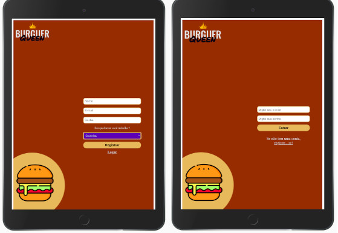

## Índice
* [0. Link do projeto](#0.Link-do-projeto) 
* [1. Resumo do Projeto](#1-Resumo-do-projeto)
* [2. Histórias de Usuário](#3-Histórias-de-Usuário)
* [3. Ferramentas utilizadas](#5-Ferramentas-utilizadas)
* [4. Autoras](#6-Autoras)
* [5. Créditos](#7-Creditos)

 ## 0.Link do projeto
 :pushpin:  Clique [___ F A Z E R ___](https:) para acessar o webapp.

## 1. Resumo do Projeto :paperclip:

O objetivo do projeto foi criar uma aplicação sob demanda para um restaurante de hambúrgueres. Esse estabelecimento está em expansão e necessita de uma interface que será usada para atendimento dos clientes e gerenciamento dos pedidos. Para isso a aplicação será utilizada tanto pelos funcionários que trabalham no salão (fazendo e entregando pedidos aos clientes) como pela cozinha (responsável por receber e preparar os pedidos vindos do salão). Os funcionários trabalharão utilizando um tablet, e deve haver um fluxo ordenado e eficiente entre pedidos realizados, preparados e entregues ao cliente. 

A lógica do projeto foi implementada em Javascript usando a biblioteca React. Trata-se de um aplicativo web executado para ser rodado especificamente em tablets, mas que se adapta bem a dispositivos de outros tamanhos. 

Abaixo segue algumas informações importantes sobre o restaurante e que foram levadas em consideração durante o planejamento e execução do projeto:

### Ambientes do estabelecimento: 
Dois ambientes com funções diferentes:

1.Salão: funcionários recebem os clientes, anotam e entregam os seus pedidos. 
2.Cozinha: funcionários preparam os pedidos e sinalizam quando eles estão prontos. Os cozinheiros também desejam ter acesso a um histórico de todos os pedidos para eventuais consultas. 

### Menu do restaurante
O restaurante possui dois menus: um com itens de ___café-da-manhã___ e outro com itens para o ___restante do dia___. 
Apesar de serem categorias diferentes, o cliente pode escolher itens das duas categorias em um mesmo pedido. Uma informação importante repassada pelo restaurante é que os clientes são bastante indecisos, sendo comum mudarem o pedido várias vezes antes de finalizar. Isso foi levado em consideração durante o desenvolvimento. 

## 2. Histórias de Usuário:
A aplicação foi desenvolvida orientada pelas seguintes histórias de usuário:

**Histórias de Usuário 1:** 
Eu como funcionário do restaurante quero entrar na plataforma e ver apenas a tela importante para o meu trabalho.

**Solução:** o usuário deve se registrar no aplicativo usando e-mail e senha e especificar qual é seu local de trabalho (salão ou cozinha). A partir daí cada vez que o usuário loga ele é direcionado para o seu ambiente de trabalho. Cada ambiente fornece acesso à páginas diferentes:
* ___Salão:___ acesso às páginas _"Salão"_ (registro dos pedidos dos clientes na comanda e envio para a cozinha) e _"Pedidos Prontos"_ (lista de pedidos já preparadas e na fila de espera para entrega). 

* ___Cozinha___ : acesso às páginas _"Cozinha"_ (lista de pedidos a serem preparados) e _"Histórico"_ (lista para consulta de todos os pedidos preparados)

**Histórias de Usuário 2:** Eu como garçom/garçonete quero poder anotar o pedido dos clientes e enviar para o preparo na cozinha. 
**Solução:** página "Salão" dá acesso à comanda de pedidos, onde o funcionário deve adicionar as informações do cliente (nome e mesa), dos itens e da dquantidade dos itens escolhidos pelos clientes. Também pode visualizar o preço do pedido. O pedido pronto é enviado para a cozinha quando solicitado por ele. 

**Histórias de Usuário 3:** Eu como chefe de cozinha quero ver os pedidos dos clientes, marcar os pedidos prontos e notificar o salão para a entrega.
**Solução**:  página "Cozinha" recebe de forma síncrona os novos pedidos realizados no salão, com o horário do pedido registrado. É possível ter maior controle sobre quais itens de cada pedido já foram preparados checando cada um deles. É possível também sinalizar quais pedidos da lista já estão em preparação, a fim de evitar a execução do mesmo pedido por cozinheiros diferentes, caso haja. Após a finalização do preparo, o cozinheiro pode marcar o pedido como __"Pedido Pronto"__, e ele será excluído da lista visível na tela. Já a página "Histórico" dá acesso ao cozinheiro a todos os pedidos finalizados, incluindo o tempo de preparo de cada um deles.

**Histórias de Usuário 4:** Eu como garçom/garçonete quero ver os pedidos que estão prontos para entregá-los rapidamente aos clientes.
**Solução**:  página "Pedidos Prontos" recebe de forma síncrona os novos pedidos já preparados na cozinha. O funcionário pode marcar cada pedido como __"Pedido Entregue"__, e ele será excluído da lista visível na tela. 

## 3. Ferramentas utilizadas :wrench:
* [React](https://pt-br.reactjs.org/) - biblioteca Javascript para criar interfaces de usuário
* [Node.js](https://nodejs.org/en/) - plataforma de desenvolvimento.
* [VSCode](https://code.visualstudio.com/) - editor de texto
* [NPM](https://www.npmjs.com/) - gerenciador de pacotes
* [Jest](https://jestjs.io/pt-BR/) - framework de testes unitários
* [Figma](https://www.figma.com/) e [MarvelApp] (https://marvelapp.com/) - plataforma de prototipagem
* [Trello](https://trello.com/pt-BR) - gerenciador de projeto

## 4. Autoras :email:
Luana Arêdes
Nathalia Monalisa Francisco

## 5. Créditos:
* Ícones: [FlatIcon](https://www.flaticon.com/)
